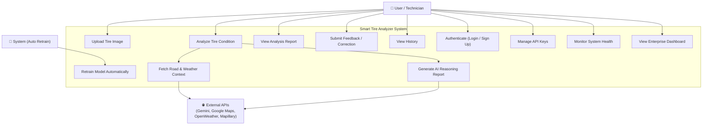
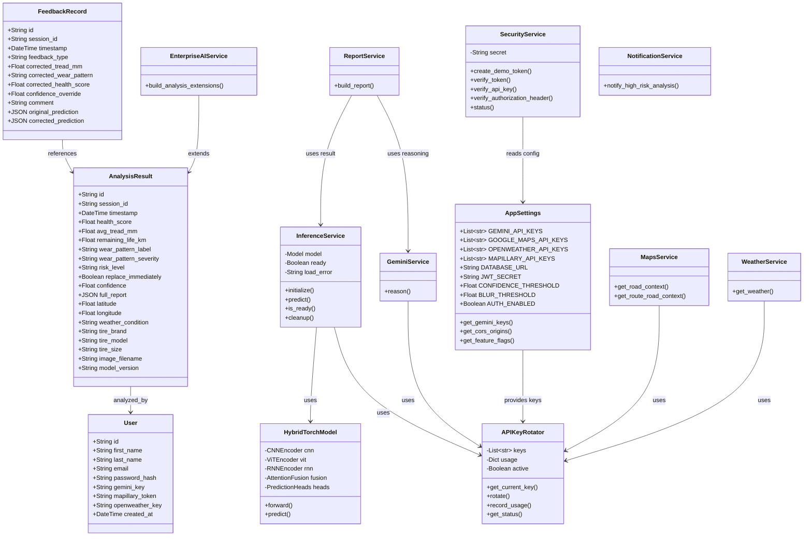
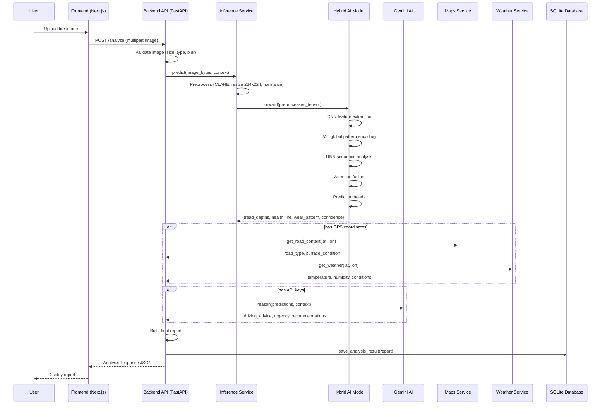
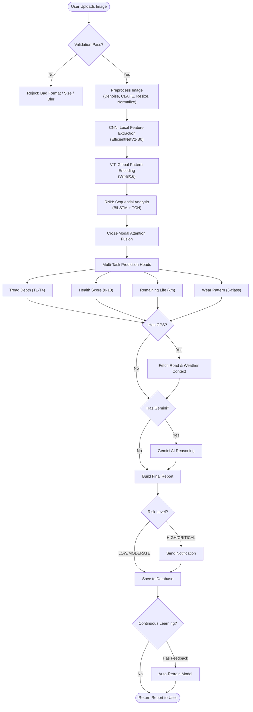
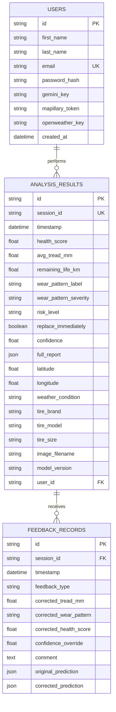
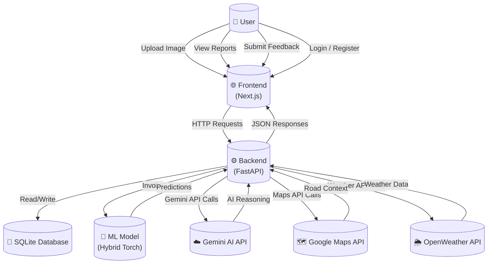
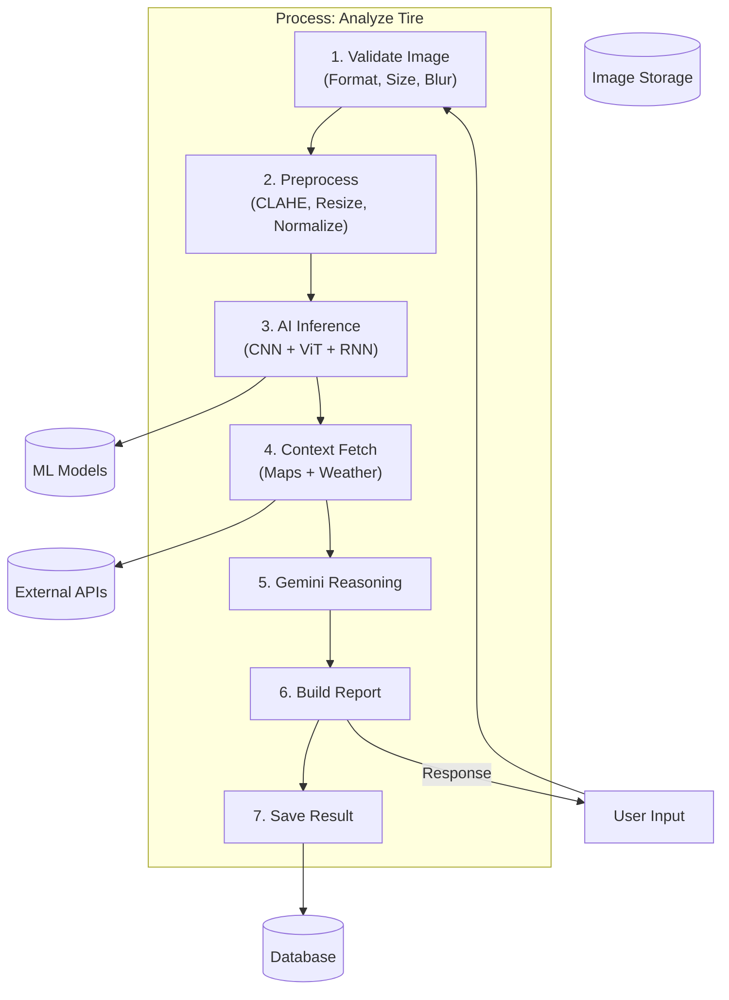
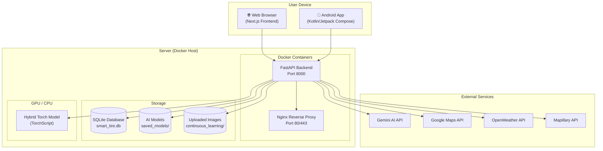
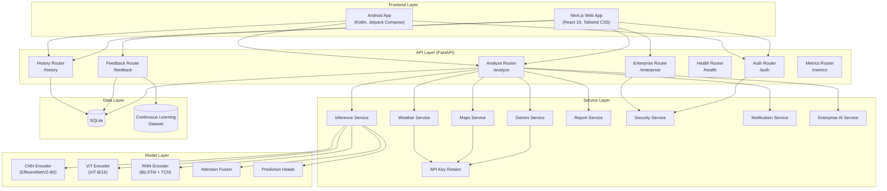
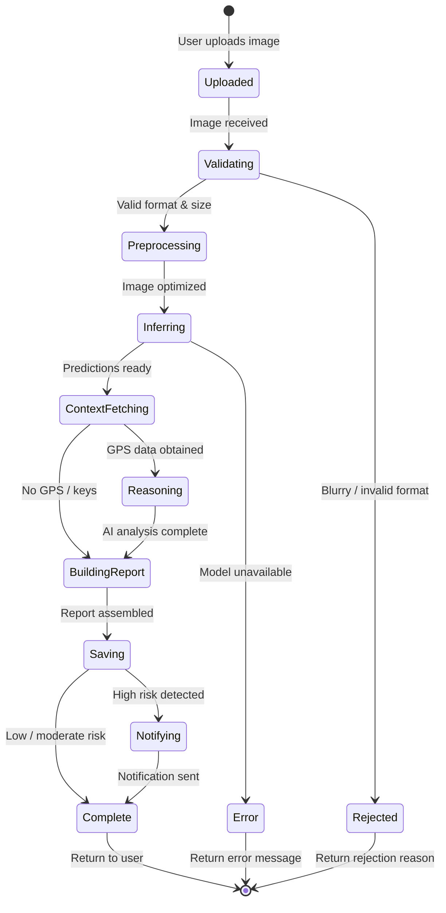

# UML Diagrams — Smart Tire Analyzer

## 1. Use Case Diagram

---

## 2. Class Diagram

---

## 3. Sequence Diagram — Tire Analysis Flow

---

## 4. Activity Diagram — Tire Analysis Workflow

---

## 5. Entity-Relationship (ER) Diagram

---

## 6. Data Flow Diagram (DFD) — Level 0

---

## 7. DFD Level 1 — Analysis Process

---

## 8. Deployment Diagram

---

## 9. Component Diagram

---

## 10. State Diagram — Analysis Lifecycle

